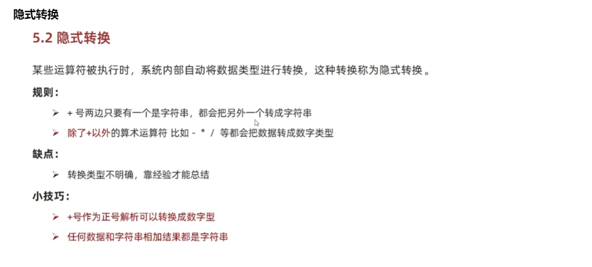
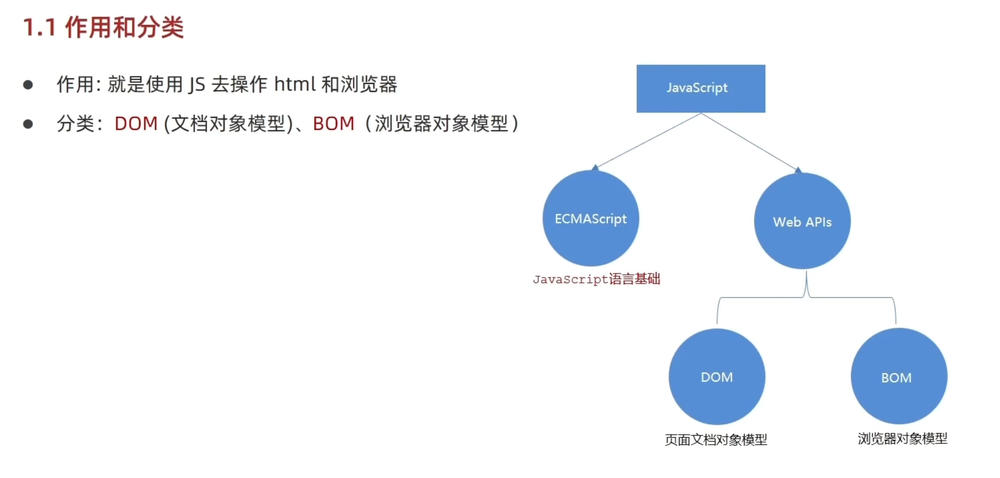
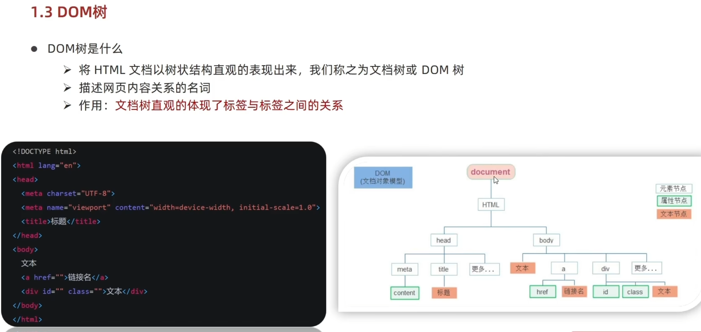
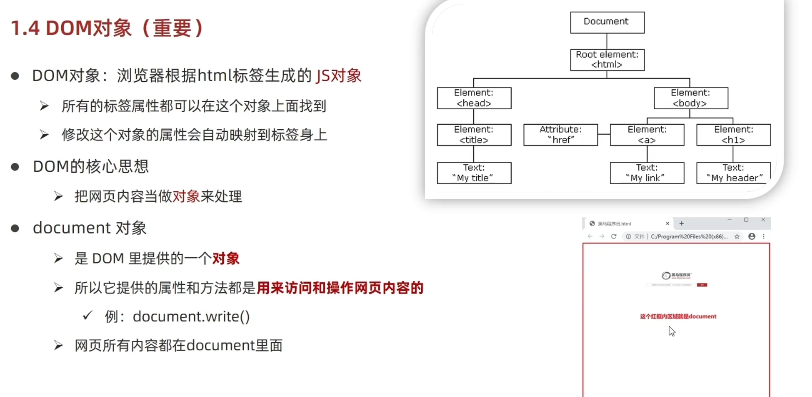
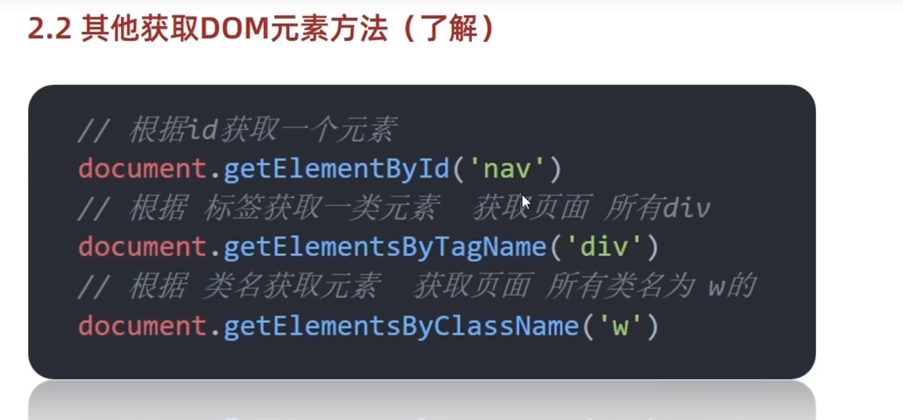
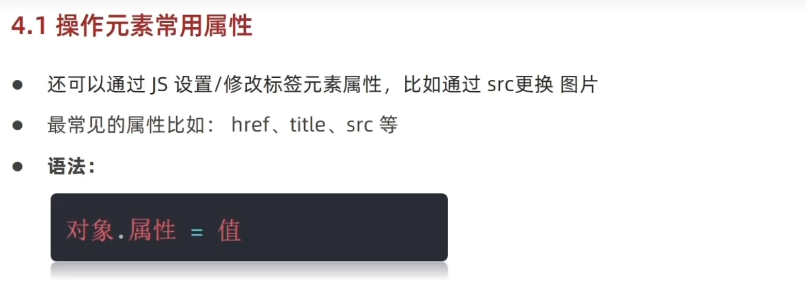
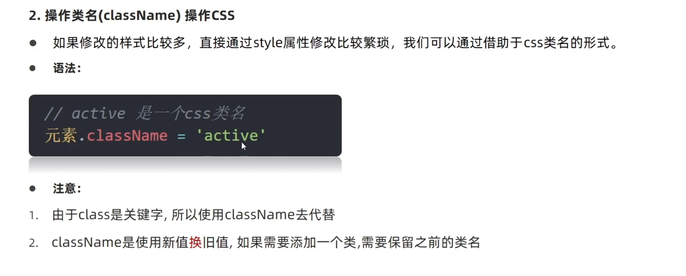
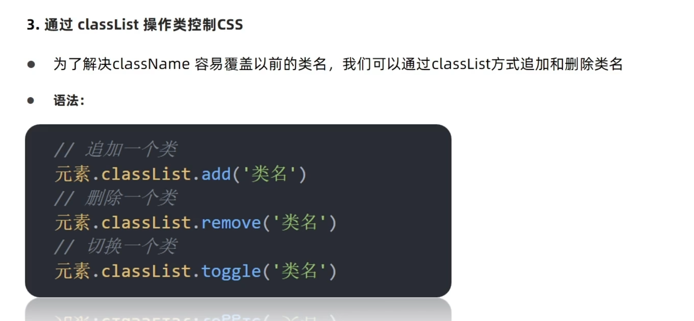
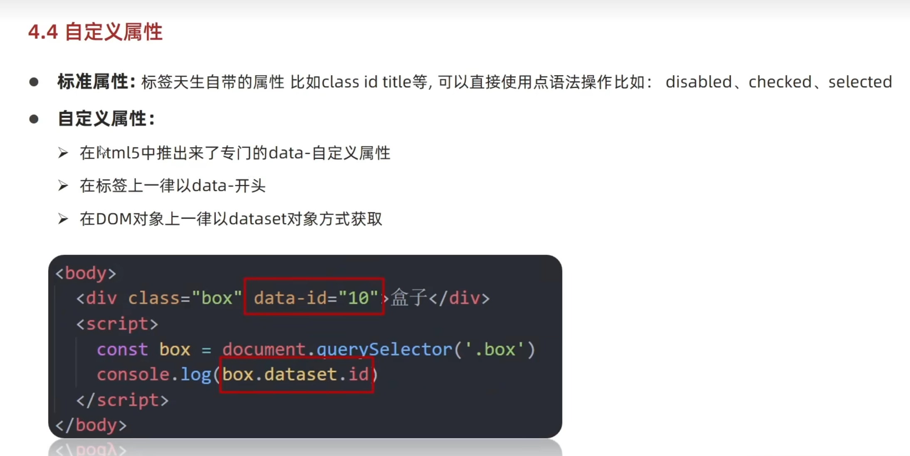

## 数据类型
数值型(Number)、字符串型、布尔型(Boolean)、未定义型(undefined)


## 输出语法
```javascript
document.write("页面文本输出")
alert("浏览器文本输出")
console.log("控制台文本输出")
```

## 输入语法
```javascript
// 浏览器输入
prompt("请输入文本")
```

## 变量声明
```javascript
// let可用于变量声明,不可重复声明，声明变量为局部变量
let age = 18
// var 声明变量为全局变量，可重复声明
// 基本已经弃用
var age = 18
```

## 常量声明
```javascript
// const,初始化赋值，不可更改
const pi = 3.14
```

## 模板字符串
```javascript
// 用``进行字符串包裹，用${}进行变量包裹
let age = 18
document.write(`今年${age}岁`)
```

## 类型检测
```javascript
// 用运算符号进行检测
typeof age
// 以函数形式进行检测
typeof(age)
```

## 类型转换
**隐式转换**

**显式转换**
```javascript
let age = "18"
// 数值转换
Number(age)
// 转换为整数，在文本中提取整数，必须是数据开头
ParseInt(age)
// 转换为浮点数，在文本中提取数据，必须是数据开头
ParseFloat(age)

```
## 运算符
```javascript
// 二元运算符
// == 比较值是否相等
// ===比较是否全等，值和类型是否相等
// 逻辑运算符
// && 与            ||或            ！非
```
## 表达式与语句
### 分支语句
```javascript
if(判断条件){
    执行语句
}
else{
    执行语句2
}

// 例子
if(num>2){
    console.log("语句执行")
}
else{
    console.log("语句2执行")
}


// switch分支语句，与break搭配使用，不然会出现数据穿透
switch (数据){
    case 数据1：
        执行代码1
        break
    case 数据2：
        执行代码2
        break
    default：
        执行语句
}

// 例子
switch (1){
    case 1:
        alert("执行语句1")
        break
    case 2:
        alert("执行语句2")
        break
    default:
        alert("执行语句")
}
```
### 三元运算符
常用于赋值
```javascript
条件 ？执行语句1 : 执行语句2

// 例子
num>3 ? alert("执行语句1") ： alert("执行语句2")
```

## 循环语句
```javascript
// while 循环
while (循环条件) {
    循环语句
}
// 例子
let num = 1
while(num<=3) {
    alert(`循环${num}次`)
    num++

// for循环
for(起始条件，终止条件，变化量){
    循环语句
}
// 例子
for(let i=1;i<=10;i++){
    alert(`循环${i}次`)
}

// 数组遍历
let arr = ["a","b","c"]
for(let i = 1;i<=arr.length-1;i++){
    console.log(arr[i])
}
```
##数组操作
```javascript
let arr = ["a","b","c"];
// 新增元素
push():在末尾增加元素,可以追加多个，且有返回值，返回值为增加后的数组长度
unshift():在开头插入元素，语法与`push()`一致
// 例子
arr.push("d")
arr.push("d","e")
result = arr.push("d")

// 删除元素
pop():删除末尾最后一个元素，返回值为删除值
shift():删除开头第一个元素
splice():删除指定元素
arr.splice(起始元素索引,元素个数)
// 例子
arr.pop()

arr.splice(2,2)
// 修改元素
arr[2] = 10

```

##函数
```javascript
function 函数名(){
    函数体
}
// 例子
function add(){
    alert("这是一个函数")
}
```


## 作用域
### 全局作用域
在script中声明的变量
### 局部作用域
在函数中声明的局部变量
**for循环中的i,j...为局部变量，不能直接访问**
```javascript
for(i=1;i<10;i++){
    console.log("局部作用域测试")
}
// 循环结束后，i无法在script中直接访问出10
```


## 匿名函数
用函数表达式的方式构建，区别与具名函数，`不存在函数名`
```javascript
let fn = function(参数){
    函数体
} 

// 例子
let fn = function(){
    console.log("匿名函数测试")
}
```
## 立即执行函数
当同事使用两个立即执行函数时，需要用";"进行分隔
```javascript
// 非同时两个立即执行函数无需使用';'进行分隔
(function(){alert("测试立即执行函数")})()
alert("分隔测试")
// 两个立即执行函数需要使用";"进行分隔
(function(){alert("测试立即执行函数")})()；
(function(){alert("测试立即执行函数")})()
```

## 对象
```javascript
// 对象构造
let 对象 = {
    属性名:属性值，
    方法名:函数
}

// 增删改查
// 增加
对象名.新属性 = 属性值
// 修改
对象名.属性 = 新属性值
// 删除
delete 对象名.属性
// 查找
对象名.属性
对象名["属性"]

// 对象遍历
let obj = {
    name:"jeck",
    age:18,
    gender:"man"
}
for(key in obj){
    console.log(obj[key])
}
// 遍历出来的值是带引号的字符串，因此不能用**.属性**进行获取值
```

## 内置对象
 [数学函数](https://developer.mozilla.org/zh-CN/docs/Web/JavaScript/Reference/Global_Objects/Math)
```javascript
// 四舍五入
Math.round()
// π
Math.PI
```

## 随机数
生成m，n之间的随机整数
```javascript
Math.floor(Math.random()*(m-n+1))+n
```

## web Api


## dom
### dom 树

### dom对象


### dom对象获取
css选择器获取对象
```javascript
// 选择匹配第一个元素，返回值为对象
document.querySelector("css选择器")
// 例子
// 容器
document.querySelector("div")
// class
document.querySelector(".main")
// id
document.querySelector("#id")
// 嵌套
document.querySelector("ul li:first-child")

// 选择匹配全部元素，返回值为对象数组
document.querySelectorAll("css选择器")

```
其他获取方式


## 操作元素内容
### 对象.innerText
只识别文本内容，不解析标签

### 对象.innerHTML
不仅可以识别文本内容，还会解析标签

## 操作元素属性
### 常用属性操作


### 样式属性操作
#### 操作样式修改css
对于如background-color 带分隔符的属性用小驼峰命名法获取属性
```javascript
const bgColor = document.querySelector("div")
bgColor.backgroundColor = "pink"
```
#### 操作类名修改css

```javascript
<div class="wrapper">
        <strong>年会抽奖</strong>
        <h1>一等奖<span id="one"></span></h1>
        <h2>二等奖<span id="two"></span></h2>
        <h3>三等奖<span id="three"></span></h3>
</div>
<style>
        .wrapper {
            height: 500px;
            width: 600px;
        }
        .newClass{
            height: 300px;
            width: 500px;
            background: #000;
        }
</style>
<script>
        const div = document.querySelector("div.wrapper")
        {/* 修改新类名 */}
        div.className = "newClass"
        {/* 保留旧类名 */}
        div.className = 'wrapper newClass'
</script>
```
#### 通过classList操作css


### 操作表单属性
#### 表单内容获取
```javascript
// 表单内容获取
const form = document.querySelector("input")
const value = form.value

// 按钮禁用
const buttom = document.querySelector("buttom")
const buttom.disabled = true

// 复选框选中
const check = document.querySelector(".checked")
const check.checked = true
```
### 自定义属性
自定义属性一律用`data-`开头
自定义属性的一律以`dataset`对象方式获取
```javascript
    <div class="box" data-id="10">盒子</div>
    <script>
        const box = document.querySelector('.box')
        console.log(box.dataset.id)
    </script>
```


## 定时器
### 开启定时器
```javascript
let n = setInterval(函数名,间隔时间)
// 间隔时间单位是毫秒
// 函数不加小括号
// 有一个返回值
```
### 关闭定时器
```javascript
clearInterval(n)
```

## 事件监听
```javascript
对象元素.addEventListener("事件类型",执行函数)
// 事件源
// 事件类型：触发方式，比如鼠标单击click
// 函数调用

// 鼠标事件
click:鼠标点击
// 两种鼠标经过/离开事件没有冒泡效果
mouseenter:鼠标经过
mouseleave:鼠标离开
// 两种鼠标经过/离开事件有冒泡效果
mouseover:鼠标经过
mouseout:鼠标离开

// 表单事件
focus:获得焦点
blur:失去焦点

// 键盘事件
keydown:键盘按下触发
keyup:键盘抬起触发

// 输入事件
input:用户输入事件
```

## 事件对象
对象里有事件触发时的相关信息
在事件绑定的回调函数里第一个参数，命名为`event`、`ev`、`e`
```javascript
元素.addEventListener("事件类型",function(e){
    执行语句
})
```
### 获取事件属性
```javascript
type:获取当前事件类型
clientX/clientY:获取光标相当于浏览器可见窗口左上角的位置
offerX/offerY:获取光标相当于当前dom元素左上角的位置
key:用户按下的键盘键的值
```
去除字符串左右两侧空格函数`trim()`

## 环境对象
指代函数内部的变量`this`，表示函数运行时所处的环境
**调用规则**：谁调用函数，this指向谁

## 回调函数
将函数A作为参数传递给函数B，称为函数A为回调函数

## 事件流
事件执行的完整执行过程中的流动路径
包括两个阶段**事件捕获**和**事件冒泡**
**事件捕获**：先调用父元素，再调用子元素
**事件冒泡**：当一个元素触发事件之后，会依次向上调用所有父级元素的同名事件(从子到父)`事件触发默认为事件冒泡`
```javascript
   <div class="father" style="width: 500px; height: 250px; background-color: pink;">
        <div class="son" style="width: 100px; height: 100px; background-color: blue;"></div>
    </div>
    <script>
        document.addEventListener("click", function(){
            alert("grandfather")
        })
        document.querySelector(".father").addEventListener("click", function(){
            alert("father")
        })
        document.querySelector(".son").addEventListener("click", function(){
            alert("son")
        })
    </script>
```

## 阻止冒泡
把时间限制在当前元素内
```javascript
事件对象.stopPropagation()
```
**实例**
```javascript
<div class="father" style="width: 500px; height: 250px; background-color: pink;">
        <div class="son" style="width: 100px; height: 100px; background-color: blue;"></div>
    </div>
    <script>
        document.addEventListener("click", function(){
            alert("grandfather")
        })
        document.querySelector(".father").addEventListener("click", function(){
            alert("father")
        })
        document.querySelector(".son").addEventListener("click", function(e){
            alert("son")
            e.stopPropagation()
        })
    </script>
```

## 事件解绑
`匿名函数无法接触事件绑定`
```javascript
对象元素.removeEventListener("事件类型",执行函数)
```

## 事件委托
利用`事件冒泡`实现，给`父元素注册事件`,触发子元素时，可以冒泡到父元素身上，从而触发父元素事件
优点：减少注册次数，提高性能
**实现**
```javascript
// 获取指定子元素
事件对象.target.tagName

// 例子
// 获取的子元素要全部大写————"LI"
<div>
        <li class = "pointer">第1个标签</li>
        <li class = "pointer">第2个标签</li>
        <li class = "pointer">第3个标签</li>
        <li class = "pointer">第4个标签</li>
        <li class = "pointer">第5个标签</li>
        <p>特殊元素</p>
    </div>

    <script>
        const father = document.querySelector("div")
        father.addEventListener("click",function(e) {
            if(e.target.tagName === "LI"){
                e.target.style.color = "red"
            }
            
        })

    </script>
```
## 阻止默认行为
表单提交时，不满足条件时，不发生页面跳转
```javascript
e.preventDefault()
```

## 其他事件
### 页面加载事件
外部资源加载完毕时触发的事件
事件名：`load`
### 页面滚动事件

### 页面尺寸事件