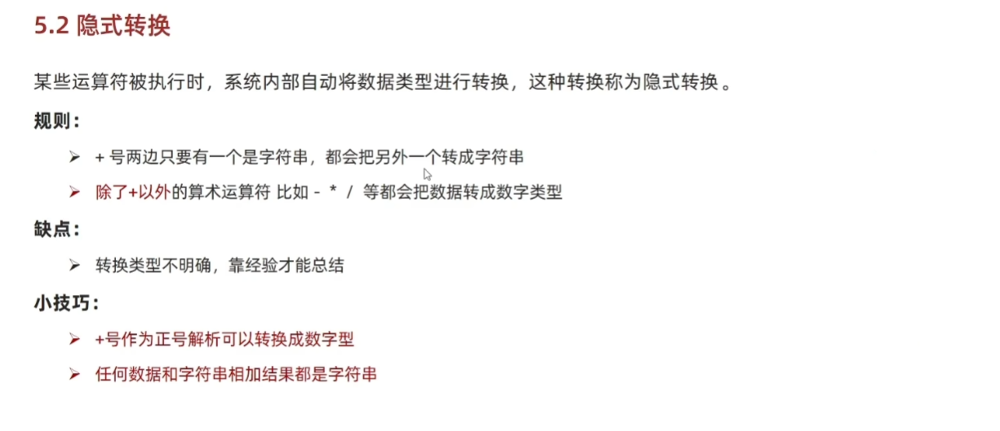

## 数据类型
数值型(Number)、字符串型、布尔型(Boolean)、未定义型(undefined)


## 输出语法
```javascript
document.write("页面文本输出")
alert("浏览器文本输出")
console.log("控制台文本输出")
```

## 输入语法
```javascript
// 浏览器输入
prompt("请输入文本")
```

## 变量声明
```javascript
// let可用于变量声明,不可重复声明，声明变量为局部变量
let age = 18
// var 声明变量为全局变量，可重复声明
// 基本已经弃用
var age = 18
```

## 常量声明
```javascript
// const,初始化赋值，不可更改
const pi = 3.14
```

## 模板字符串
```javascript
// 用``进行字符串包裹，用${}进行变量包裹
let age = 18
document.write(`今年${age}岁`)
```

## 类型检测
```javascript
// 用运算符号进行检测
typeof age
// 以函数形式进行检测
typeof(age)
```

## 类型转换
**隐式转换**

**显式转换**
```javascript
let age = "18"
// 数值转换
Number(age)
// 转换为整数，在文本中提取整数，必须是数据开头
ParseInt(age)
// 转换为浮点数，在文本中提取数据，必须是数据开头
ParseFloat(age)

```
## 运算符
```javascript
// 二元运算符
// == 比较值是否相等
// ===比较是否全等，值和类型是否相等
// 逻辑运算符
// && 与            ||或            ！非
```
## 表达式与语句
### 分支语句
```javascript
if(判断条件){
    执行语句
}
else{
    执行语句2
}

// 例子
if(num>2){
    console.log("语句执行")
}
else{
    console.log("语句2执行")
}


// switch分支语句，与break搭配使用，不然会出现数据穿透
switch (数据){
    case 数据1：
        执行代码1
        break
    case 数据2：
        执行代码2
        break
    default：
        执行语句
}

// 例子
switch (1){
    case 1:
        alert("执行语句1")
        break
    case 2:
        alert("执行语句2")
        break
    default:
        alert("执行语句")
}
```
### 三元运算符
常用于赋值
```javascript
条件 ？执行语句1 : 执行语句2

// 例子
num>3 ? alert("执行语句1") ： alert("执行语句2")
```

## 循环语句
```javascript
// while 循环
while (循环条件) {
    循环语句
}
// 例子
let num = 1
while(num<=3) {
    alert(`循环${num}次`)
    num++

// for循环
for(起始条件，终止条件，变化量){
    循环语句
}
// 例子
for(let i=1;i<=10;i++){
    alert(`循环${i}次`)
}

// 数组遍历
let arr = ["a","b","c"]
for(let i = 1;i<=arr.length-1;i++){
    console.log(arr[i])
}
```
##数组操作
```javascript
let arr = ["a","b","c"];
// 新增元素
push():在末尾增加元素,可以追加多个，且有返回值，返回值为增加后的数组长度
unshift():在开头插入元素，语法与`push()`一致
// 例子
arr.push("d")
arr.push("d","e")
result = arr.push("d")

// 删除元素
pop():删除末尾最后一个元素，返回值为删除值
shift():删除开头第一个元素
splice():删除指定元素
arr.splice(起始元素索引,元素个数)
// 例子
arr.pop()

arr.splice(2,2)
// 修改元素
arr[2] = 10

```
